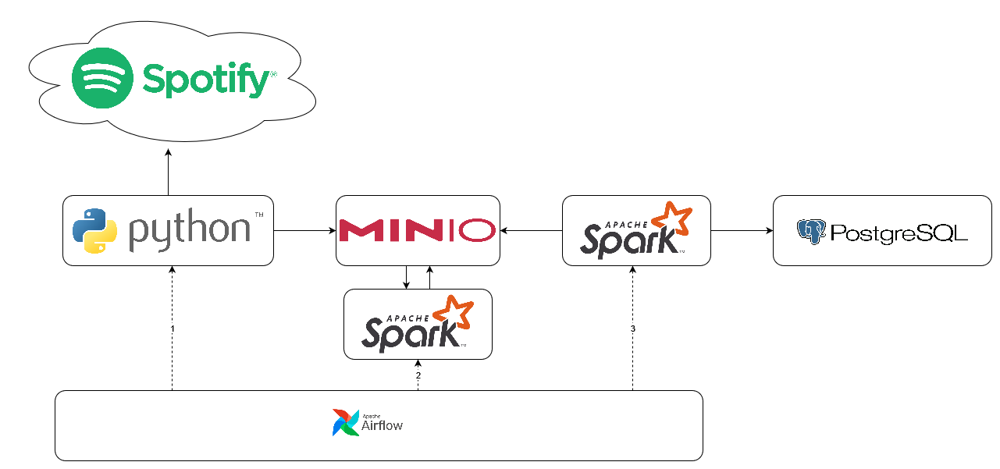

# Spotify Analytics
Learning project for Spark/PySpark using Airflow, MinIO, PostgreSQL and the Spotify Developer API.

## Architecture Overview
A plain python script is used to query the *new releases Spotify API* (https://api.spotify.com/v1/browse/new-releases) and store the raw data as json files in *minio object storage*.
The raw json files are then processed using *Apache Spark* with *Pyspark*. The results are stored back into minio.
On the last step transformed and cleaned data is loaded into *PostgreSQL* using Spark. Intermittened processing results, as well as raw data is kept for lineage purposes.

